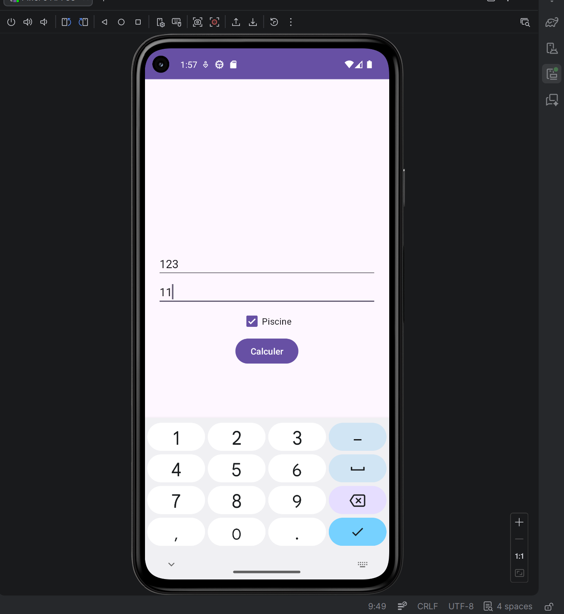

# 🏠 TaxCalculator-Android | Simulateur d'Impôts Fonciers

## 📝 Description
Ce projet est une application mobile Android développée en **Java** permettant de calculer une estimation des impôts fonciers. L'utilisateur saisit la surface de son habitation, le nombre de pièces et précise s'il possède une piscine pour obtenir un montant total instantané.

Ce laboratoire m'a permis de consolider mes bases en développement mobile, notamment sur la gestion des layouts XML et l'interaction entre l'interface utilisateur et la logique métier.

##  Fonctionnalités
- **Saisie de données** : Interface optimisée pour les nombres (`inputType="number"`).
- **Options personnalisées** : Utilisation d'une `CheckBox` pour inclure ou exclure les équipements de luxe (piscine).
- **Calcul en temps réel** : Algorithme de calcul déclenché par un bouton.
- **Robustesse** : Gestion des erreurs pour éviter les crashs en cas de champs vides ou de saisies invalides.

##  Algorithme de Calcul
L'impôt est calculé selon la formule suivante :

$$Total = (Surface \times 2) + (Pièces \times 50) + \text{Supplément Piscine}$$

* **Taxe Surface** : 2 DH par $m^2$.
* **Taxe Pièces** : 50 DH par pièce.
* **Option Piscine** : Forfait fixe de 100 DH.

##  Captures d'écran
| Interface de saisie | Résultat du calcul |
| :---: | :---: |
|  |  |

##  Installation & Configuration
1.  **Cloner le projet** :
    
    git clone [https://github.com/votre-username/TaxCalculator-Android.git](https://github.com/votre-username/TaxCalculator-Android.git)
    
    
3.  **Ouvrir dans Android Studio** :
    - Importer le projet via `File > Open`.
    - Laisser Gradle synchroniser les dépendances.
4.  **Lancement** :
    - Utiliser un émulateur (AVD) ou un appareil physique avec le débogage USB activé.
    - Version minimale supportée : **Android 13 (API 33)**.

## 📂 Architecture du Projet
- `activity_main.xml` : Design en `LinearLayout` (vertical) avec gestion de la gravité et du padding.
- `MainActivity.java` : Initialisation des composants avec `findViewById`, gestion de l'événement `setOnClickListener` et logique de calcul sécurisée par des vérifications de chaînes de caractères.

---
**Développé par Aourik Anas** *Élève Ingénieur en 4ème année Génie Cyber defence et systemes de telecom embarque - ENSA Marrakech*
